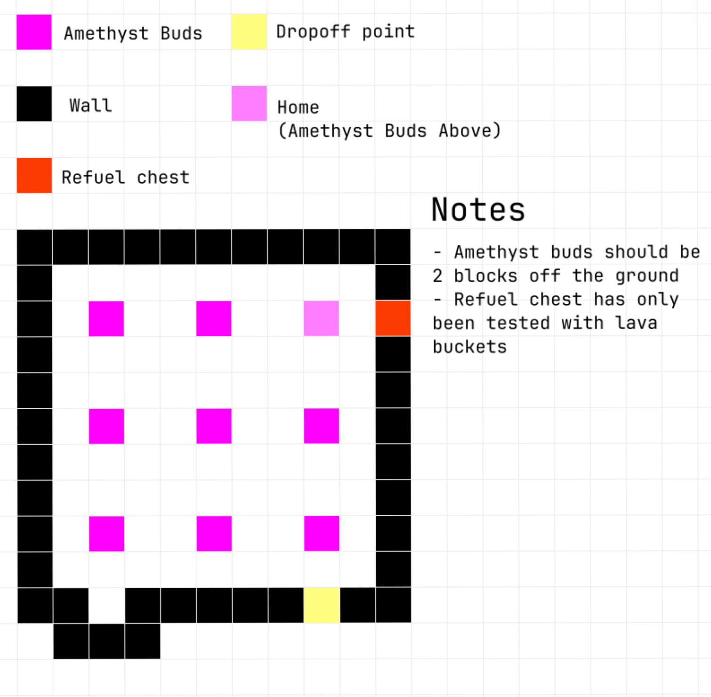

# computercraft-archive

### list of files and what they do:

# [amethyst-miner.lua](amethyst-miner.lua) 
i made this to automate amethyst collection for my estrogen farm, it's not the greatest looking thing ever nor is it very fast but it works.

by default, the program assumes the configuration shown in the diagram. this can be changed by editing the `startMining()` function. for different configurations you may also need to add another direction to the `rowNav()` function and/or add additional mining functions.

this program requires an advanced mining turtle (normal mining turtle might work, haven't tested) and an amethyst cluster for comparing the blocks and detecting which ones to mine

improvements that could be made:
- ~~replace a ton of the `startMining()` function with simpler and faster `rowNav()` commands, like just doing a ring around the top of every cluster to get the sides and the top~~
- replace `turtle.compare*()` functions with `turtle.inspect()` to remove the dependency on the amethyst cluster in the selected slot
- ~~detect if there's already an amethyst cluster in the inventory on startup~~

# [lift-controller](./lift-controller/)
i made this to make a large-scale elevator for my cactus farm, which goes from the bottom of the world to the top of the world. i originally used redstone links to control the elevator, but they have limited range. you know what has unlimited range though? ender modem 🤑

improvements that could be made:
- field to change the amount of floors you traverse with a click
- auto-leveling
- nicer client ui in general

# [factory-monitor](./factory-monitor)
bundle of scripts to autenticate access to a computer running the factory monitoring software, sha256 hashed disk password protection optional

barebones setup in the script uses a computercraft: create bridge display target to monitor su and it sends you a notification if the network enters overstress

improvements that could be made:
- modular system for the loop instead of hacking shit into the script
